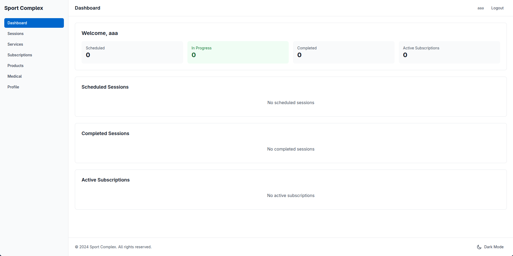
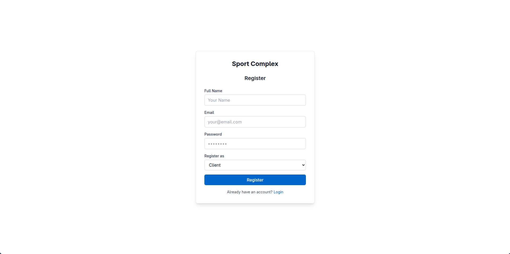
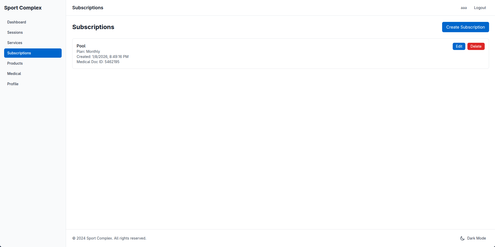
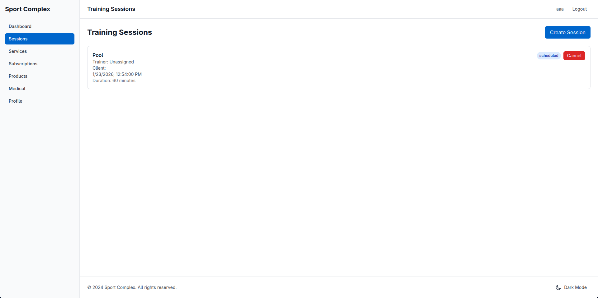
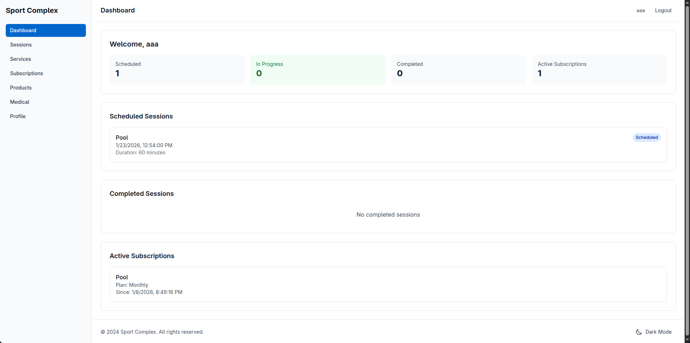

# Sport Complex Management System

A full-stack web application for managing a sport complex with multi-database architecture, featuring client management, trainer scheduling, subscription handling, and role-based access control.




### Multi-Database Architecture
- MySQL - Primary relational data (users, subscriptions, sessions, products)
- Redis - Caching 
- CouchDB - Document storage for medical records
- Neo4j - Graph database for relationship mapping (client-trainer-service connections)

### Core Functionality
- JWT Authentication 
- Role-Based access control (Client, Trainer, Admin) 
- Training session management 
- Subscription system 
- Trainer specializations
- Product Management (inventory and sales)

### User Roles
- Clients - Book sessions, manage subscriptions, upload medical documents
- Trainers - Manage schedules, view assigned sessions, set specializations
- Admins - Full system control, user management, analytics

---

### Backend
- FastAPI
- SQLAlchemy
- Pydantic
- PyJWT
- Passlib

### Frontend
- Vue
- Vue Router
- Axios 
- Tailwind CSS 
- Vite 

### Databases
- MySQL 
- Redis
- CouchDB
- Neo4j

---

### Prerequisites
- Python 3.8+
- Node.js 16+
- Docker (for database containers)

## Setup

### 1. Clone the Repository
```bash
git clone https://github.com/yourusername/sport-complex-management.git
cd sport-complex-management
```

### 2. Database Setup

#### Install Redis
```bash
docker run --name sport-redis -p 6379:6379 -d redis
```

#### Install MySQL
```bash
docker run --name sport-mysql -e MYSQL_ROOT_PASSWORD=root-pw -p 3306:3306 -d mysql
```

#### Configure MySQL Database
```bash
# Install phpMyAdmin for easy MySQL management
docker run --name phpmyadmin -d --link sport-mysql:db -p 8080:80 phpmyadmin
```

Then navigate to `http://localhost:8080/`:
- Username: `root`
- Password: `root-pw`
- Go to User accounts -> Add user account
- User name: `sport-complex-cw`
- Password: `sport-complex-cw`
- Check: Create database with same name and grant all privileges

#### Install CouchDB
```bash
docker run --name sport-couchdb \
  -e COUCHDB_USER=couchdb \
  -e COUCHDB_PASSWORD=couchdb \
  -p 5984:5984 -d couchdb
```

#### Install Neo4j
```bash
docker run --name sport-neo4j -p 7474:7474 -p 7687:7687 -d neo4j
```

Navigate to `http://localhost:7474/`:
- Default credentials: `neo4j` / `neo4j`
- Set new password to: `neo4jneo4j`

### 3. Backend Setup

```bash
# Create virtual environment
python -m venv .venv
source .venv/bin/activate  # On Windows: .venv\Scripts\activate

# Install dependencies
pip install -r requirements.txt

# Create .env file
cat > .env << EOF
SECRET_KEY=your-secret-key-here-change-this-in-production
ALGORITHM=HS256
ACCESS_TOKEN_EXPIRE_MINUTES=30
EOF

# Run the backend
python main.py
```

The API will be available at `http://localhost:8000`  
Interactive API documentation: `http://localhost:8000/docs`

### 4. Frontend Setup

```bash
cd frontend

# Install dependencies
npm install

# Run development server
npm run dev
```

The frontend will be available at `http://localhost:3000`

---

### Showcase





---

Note: This project demonstrates proficiency in:
- RESTful API design
- Multi-database architecture
- Authentication & authorization
- Modern frontend frameworks
- Docker containerization
- Database modeling & relationships
